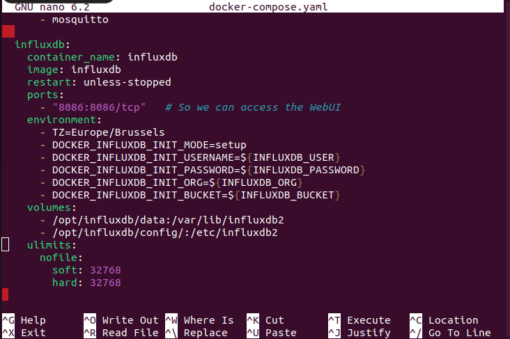
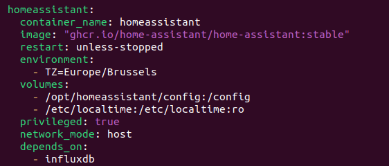
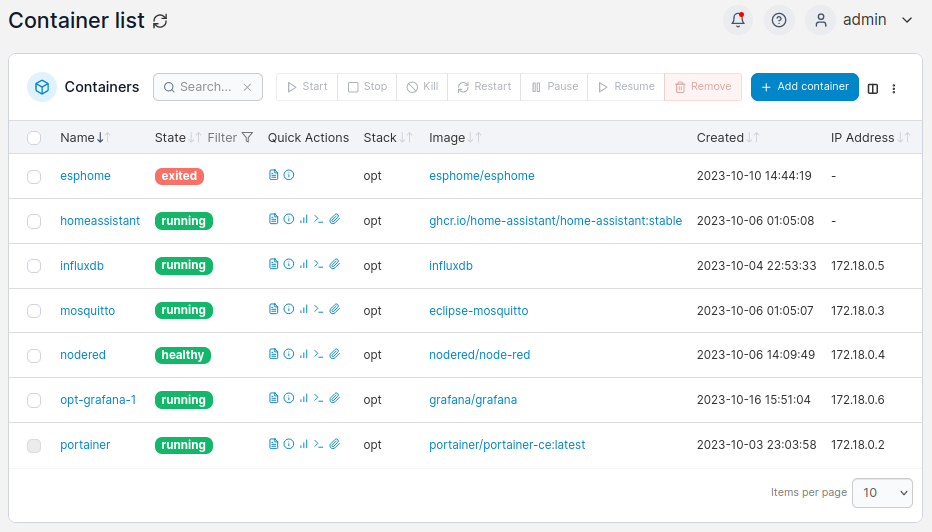
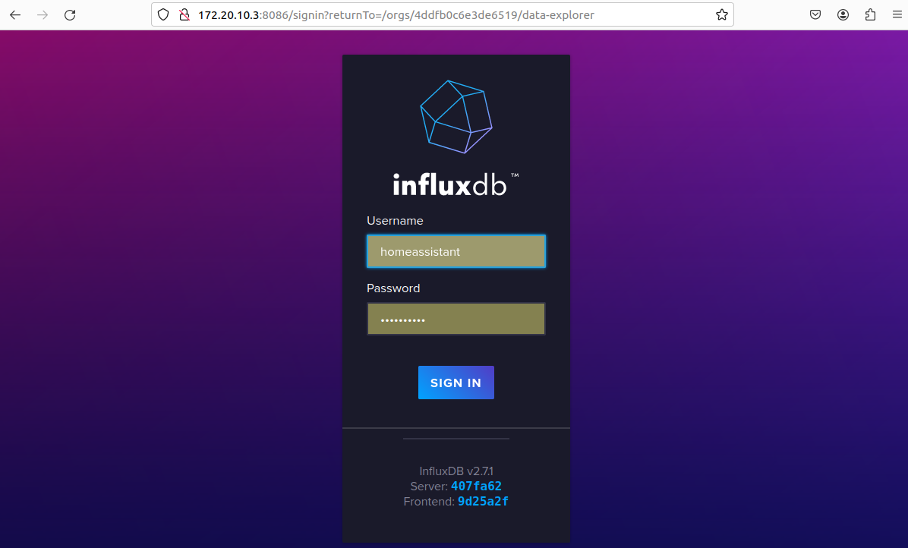
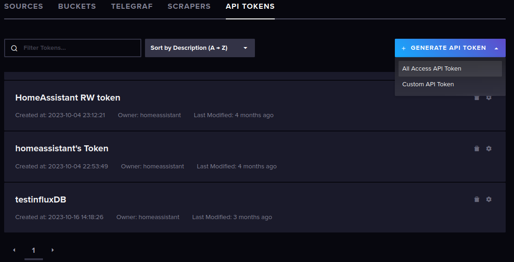
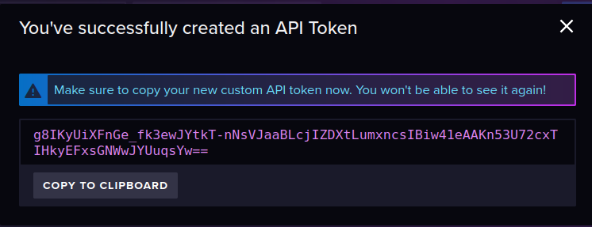

# ติดตั้ง InfluxDB   

### Intro  
หลังจากเราได้ทำการติดตั้ง Home Assistant แล้ว ในส่วนนี้เราจะทำการตั้งค่า Docker Compose configuration สำหรับ InfluxDB container ซึ่งเราจะใช้เพื่อจัดเก็บข้อมูลจาก Home Assistant   

###  ติดตั้ง InfluxDB  
โดยในส่วนนี้เราจะเริ่มต้นด้วยการกำหนดค่า docker-compose.yaml สำหรับ container ใหม่  
เราจะทำการกำหนดค่าสำหรับ container ได้ดังนี้  

```
version: '3.0'

services:
  [...]
  homeassistant:
    [...]
  influxdb:
    container_name: influxdb
    image: influxdb
    restart: unless-stopped
    ports:
      - "8086:8086/tcp"   # So we can access the WebUI
    environment:
      - TZ=Europe/Brussels
      - DOCKER_INFLUXDB_INIT_MODE=setup
      - DOCKER_INFLUXDB_INIT_USERNAME=${INFLUXDB_USER}
      - DOCKER_INFLUXDB_INIT_PASSWORD=${INFLUXDB_PASSWORD}
      - DOCKER_INFLUXDB_INIT_ORG=${INFLUXDB_ORG}
      - DOCKER_INFLUXDB_INIT_BUCKET=${INFLUXDB_BUCKET}
    volumes:
      - /opt/influxdb/data:/var/lib/influxdb2
      - /opt/influxdb/config/:/etc/influxdb2
    ulimits:
      nofile:
        soft: 32768
        hard: 32768
```

ภาพตัวอย่าง การกำหนดค่า container influxDB ใน docker-compose.yaml ****************************  

<p align="center">
  
</p>  

### Environment variables 

จากข้างต้น เราจะสามารถสังเกตได้ว่า มีการเพิ่มตัวแปร environment เช่น ${MYSQL_ROOT_PASSWORD} โดยการเพิ่มตัวแปร environment เหล่านี้ จะทำให้เราสามารถแน่ใจได้ว่า เราจะไม่เผลอใส่ข้อมูลที่เป็น sensitive data ลง ใน docker-compose.yaml ของเรา  

สิ่งเหล่านี้จะมีประโยชน์มาก เมื่อเราต้องการ back-up หรือ distribute Docker config ใน Version Control System เช่น Github  

หากต้องการระบุ environment variable ให้สร้างไฟล์ .env ใน directory เดียวกันกับไฟล์ docker-compose.yaml เช่น /opt  

```
sudo nano .env
# Add secrets, see below

# Also grant our non-admin account to this file
#  so we don't need sudo to edit in the future
sudo chown root:docker .env
sudo chmod g+w .env
```
ไฟล์ .env จะมีลักษณะดังนี้ เราสามารถทำการแก้ไข รหัสผ่านใดๆ ได้ที่นี้  

```
INFLUXDB_USER=homeassistant
INFLUXDB_PASSWORD=influxhapassword
INFLUXDB_ORG=sequr
INFLUXDB_BUCKET=homeassistant
```

หากเราทำการเรียกใช้ config check ก่อนที่สร้างไฟล์ .env เราจะได้รับคำเตือนเหล่านี้ด้วย  

```
docker-compose -f docker-compose.yaml config

WARN[0000] The "MYSQL_HA_DATABASE" variable is not set. Defaulting to a blank string.
WARN[0000] The "MYSQL_HA_USER" variable is not set. Defaulting to a blank string.
WARN[0000] The "MYSQL_HA_PASSWORD" variable is not set. Defaulting to a blank string.
WARN[0000] The "INFLUXDB_USER" variable is not set. Defaulting to a blank string.
WARN[0000] The "INFLUXDB_PASSWORD" variable is not set. Defaulting to a blank string.
WARN[0000] The "INFLUXDB_ORG" variable is not set. Defaulting to a blank string.
WARN[0000] The "INFLUXDB_BUCKET" variable is not set. Defaulting to a blank string.
```

### Dependencies  
ในกรณีที่เราทำการ reboot Docker system เราต้องการให้  home Assistant รอให้ container InfluxDB ออนไลน์ก่อนที่จะเริ่มต้น เพื่อให้แน่ใจว่ามีการเชื่อมต่อจาก  HA ไปยังระบบเหล่านี้จะไม่มีการเชื่อมต่อล้มเหลว และไม่มีข้อมูลสูญหาย  
ดังนั้น ให้เพิ่ม depends_on ลงใน รายการ config ที่อยู่ใน Home Assistant container :  
```
[...]
  homeassistant:
    [...]
    depends_on:
      - mariadb
      - influxdb
```
ตัวอย่างการเพิ่ม depend_on  

<p align="center">
  
</p>  

### Initial run  
ในการ รัน ครั้งแรก เราสามารถรัน docker-compose up -d เพื่อเป็นการติดตั้ง container InfluxDB ได้แล้ว  
จะสามารถสังเกตเห็นว่า container Home Assistant ถูกสร้างขึ้นใหม่เมื่อมีการกำหนดค่า config ที่มีการเปลี่ยนแปลง  
ภาพตัวอย่าง container เมื่อใช้คำสั่ง docker-compose up -d  

<p align="center">
  
</p>  

### InfluxDB Token  
ในตอนนี้ InfluxDB container ของเรากำลังทำงานอยู่ เราจะสามารถเปิด WebUI เพื่อทำการรับ token ซึ่งเราจะต้องใช้ token ในภายหลังเพื่อให้ Home Assistant เข้าถึงที่เก็บข้อมูล bucket ที่เราสร้างขึ้นใหม่  
ทำการเปิด browser  แล้วไปที่  http://<ip.of.our.box>:8086 และทำการเข้าสู่ระบบ โดยใช้ข้อมูลที่เราได้ทำการตั้งค่าในไฟล์ .env  
ภาพแสดงตัวอย่างการ login InfluxDB  

<p align="center">
  
</p>  

หลังจากนั้นไปที่ เมนู API token และ  generate API token ทำการเลือก All Access API Token  
ภาพแสดงหน้าเมนู generate API token  

<p align="center">
  
</p>   

ทำการใส่ Description เมื่อทำการ generate แล้วจะได้ดังนี้  

<p align="center">
  
</p>    

### Home Assistant configuration  
