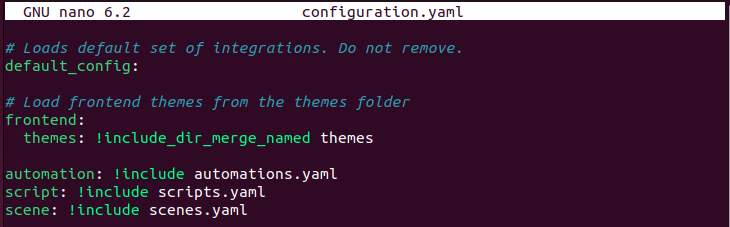
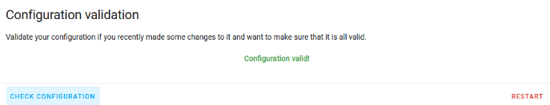
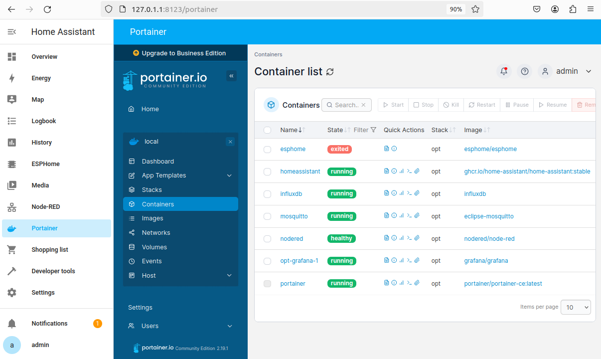

# ติดตั้ง InfluxDB   

### Intro  
หลังจากเราได้ทำการติดตั้ง Home Assistant แล้ว ในส่วนนี้เราจะทำการตั้งค่า Docker Compose configuration สำหรับ InfluxDB container ซึ่งเราจะใช้เพื่อจัดเก็บข้อมูลจาก Home Assistant   

###  ติดตั้ง InfluxDB  
โดยในส่วนนี้เราจะเริ่มต้นด้วยการกำหนดค่า docker-compose.yaml สำหรับ container ใหม่  
เราจะทำการกำหนดค่าสำหรับ container ได้ดังนี้  

```
version: '3.0'

services:
  [...]
  homeassistant:
    [...]
  influxdb:
    container_name: influxdb
    image: influxdb
    restart: unless-stopped
    ports:
      - "8086:8086/tcp"   # So we can access the WebUI
    environment:
      - TZ=Europe/Brussels
      - DOCKER_INFLUXDB_INIT_MODE=setup
      - DOCKER_INFLUXDB_INIT_USERNAME=${INFLUXDB_USER}
      - DOCKER_INFLUXDB_INIT_PASSWORD=${INFLUXDB_PASSWORD}
      - DOCKER_INFLUXDB_INIT_ORG=${INFLUXDB_ORG}
      - DOCKER_INFLUXDB_INIT_BUCKET=${INFLUXDB_BUCKET}
    volumes:
      - /opt/influxdb/data:/var/lib/influxdb2
      - /opt/influxdb/config/:/etc/influxdb2
    ulimits:
      nofile:
        soft: 32768
        hard: 32768
```

<p align="center">
  
</p>    

<p style="text-align: center;">ภาพตัวอย่าง การกำหนดค่า container influxDB ใน docker-compose.yaml</p>   


### Environment variables 

จากข้างต้น เราจะสามารถสังเกตได้ว่า มีการเพิ่มตัวแปร environment เช่น ${MYSQL_ROOT_PASSWORD} โดยการเพิ่มตัวแปร environment เหล่านี้ จะทำให้เราสามารถแน่ใจได้ว่า เราจะไม่เผลอใส่ข้อมูลที่เป็น sensitive data ลง ใน docker-compose.yaml ของเรา  

สิ่งเหล่านี้จะมีประโยชน์มาก เมื่อเราต้องการ back-up หรือ distribute Docker config ใน Version Control System เช่น Github  

หากต้องการระบุ environment variable ให้สร้างไฟล์ .env ใน directory เดียวกันกับไฟล์ docker-compose.yaml เช่น /opt  

```
sudo nano .env
# Add secrets, see below

# Also grant our non-admin account to this file
#  so we don't need sudo to edit in the future
sudo chown root:docker .env
sudo chmod g+w .env
```
ไฟล์ .env จะมีลักษณะดังนี้ เราสามารถทำการแก้ไข รหัสผ่านใดๆ ได้ที่นี้  

```
INFLUXDB_USER=homeassistant
INFLUXDB_PASSWORD=influxhapassword
INFLUXDB_ORG=sequr
INFLUXDB_BUCKET=homeassistant
```

หากเราทำการเรียกใช้ config check ก่อนที่สร้างไฟล์ .env เราจะได้รับคำเตือนเหล่านี้ด้วย  

```
docker-compose -f docker-compose.yaml config

WARN[0000] The "MYSQL_HA_DATABASE" variable is not set. Defaulting to a blank string.
WARN[0000] The "MYSQL_HA_USER" variable is not set. Defaulting to a blank string.
WARN[0000] The "MYSQL_HA_PASSWORD" variable is not set. Defaulting to a blank string.
WARN[0000] The "INFLUXDB_USER" variable is not set. Defaulting to a blank string.
WARN[0000] The "INFLUXDB_PASSWORD" variable is not set. Defaulting to a blank string.
WARN[0000] The "INFLUXDB_ORG" variable is not set. Defaulting to a blank string.
WARN[0000] The "INFLUXDB_BUCKET" variable is not set. Defaulting to a blank string.
```

### Dependencies  
ในกรณีที่เราทำการ reboot Docker system เราต้องการให้  home Assistant รอให้ container InfluxDB ออนไลน์ก่อนที่จะเริ่มต้น เพื่อให้แน่ใจว่ามีการเชื่อมต่อจาก  HA ไปยังระบบเหล่านี้จะไม่มีการเชื่อมต่อล้มเหลว และไม่มีข้อมูลสูญหาย  
ดังนั้น ให้เพิ่ม depends_on ลงใน รายการ config ที่อยู่ใน Home Assistant container :  
```
[...]
  homeassistant:
    [...]
    depends_on:
      - mariadb
      - influxdb
```

<p align="center">
  
</p>    

<p style="text-align: center;">ตัวอย่างการเพิ่ม depend_on</p>  

### Initial run  
ในการ รัน ครั้งแรก เราสามารถรัน docker-compose up -d เพื่อเป็นการติดตั้ง container InfluxDB ได้แล้ว  
จะสามารถสังเกตเห็นว่า container Home Assistant ถูกสร้างขึ้นใหม่เมื่อมีการกำหนดค่า config ที่มีการเปลี่ยนแปลง    
  

<p align="center">
  
</p>  

<p style="text-align: center;">ภาพตัวอย่าง container เมื่อใช้คำสั่ง docker-compose up -d</p>

### InfluxDB Token  
ในตอนนี้ InfluxDB container ของเรากำลังทำงานอยู่ เราจะสามารถเปิด WebUI เพื่อทำการรับ token ซึ่งเราจะต้องใช้ token ในภายหลังเพื่อให้ Home Assistant เข้าถึงที่เก็บข้อมูล bucket ที่เราสร้างขึ้นใหม่  
ทำการเปิด browser  แล้วไปที่  http://<ip.of.our.box>:8086 และทำการเข้าสู่ระบบ โดยใช้ข้อมูลที่เราได้ทำการตั้งค่าในไฟล์ .env  

<p align="center">
  
</p>    

<p style="text-align: center;">ภาพแสดงตัวอย่างการ login InfluxDB</p>  

หลังจากนั้นไปที่ เมนู API token และ  generate API token ทำการเลือก All Access API Token  

<p align="center">
  
</p>   

<p style="text-align: center;">ภาพแสดงหน้าเมนู generate API token</p>

ทำการใส่ Description เมื่อทำการ generate แล้วจะได้ดังนี้  

<p align="center">
  
</p>    

### Home Assistant configuration  
เมื่อ container พร้อมใช้งาน แล้วเราจำเป็น จะต้องบอก Home Assistant เกี่ยวกับ database เหล่านี้ด้วย  โดยเราจะเริ่ม เพิ่ม Home Assistant configuration  ครั้งแรกของเราดังนี้  

```
cd /opt/homeassistant/config/
sudo nano configuration.yaml
```

โดยเราจะสามารถเห็น การกำหนดค่า config ที่มีไว้อยู่แล้ว     

<p align="center">
  
</p>    

<p style="text-align: center;">ภาพตัวอย่างแสดง config ที่มีไว้อยู่แล้ว</p>  

เพิ่มการ config ดังนี้  

```
history:

influxdb:
  api_version: 2
  ssl: false
  host: !secret influxdb_host
  port: 8086
  token: !secret influxdb_token
  organization: !secret influx_org
  bucket: homeassistant
  tags:
    source: HomeAssistant
  tags_attributes:
    - friendly_name
  default_measurement: units
  ignore_attributes:
    - icon
  exclude:    # Customise to fit your needs
    entities:
      - zone.home
    domains:
      - persistent_notification
      - person
```

### More secrets  
จากการ config ไฟล์ด้านบน เราจะเห็นถึงการอ้างอิง secret references ในไฟล์ cobfig เช่น !secret influxdb_host  
ซึ่ง Home Assistant สามารถช่วยให้เราซ่อนความลับ จาก configuration.yaml ไฟล์เพื่อให้สามารถแบ่งปันและใช้งานได้อย่างปลอดภัย เช่นเดียวกับ environment variable ที่เราใช้ใน docker-compose.yaml ซึ่งสิ่งเหล่านี้จะเป็นการอ้างอิงข้อมูลที่เป็นความลับไว้ที่อื่น  ในกรณี key-value ในไฟล์ secrets.yaml  ซึ่งในจะอยู่ในโฟลเดอร์เดียวกับ configuration.yaml  
โดยเราจะมาสร้างไฟล์นี้ เพื่อเป็นการเห็บความลับของเราลงไป  

```
cd /opt/homeassistant/config
sudo nano secrets.yaml

```
โดยจะสั่งเกตเห็นเห็นได้ว่า ไฟล์นี้จะมีอยู่แล้วดังนี้   

```
# Use this file to store secrets like usernames and passwords.
# Learn more at https://www.home-assistant.io/docs/configuration/secrets/
some_password: welcome
```

สารมารถลบตัวอย่างนี้ และเพิ่มข้อมูลที่เป้นความลับของเราเอง  ซึ่งต้องตรวจสอบให้แน่ว่า ข้อมูลนั้นตรงกันกับการกำหนดค่าของไฟล์ .env  

```
influxdb_host: "<ip.of.our.box>"
influxdb_token: "influxdbtoken"
influx_org: "sequr"
```

เนื่องจาก container Home Assistant ของเราจะใช้ Host Network จึงไม่พบ container  InfluxDB ผ่านชื่อ Host นั้น เราจึงต้องใช้การส่งต่อ พอร์ต และ อ้างอิงผ่าน <ip.of.our.box>  

### Restart  
หลังจากบันทึกไฟล์แล้ว ให้ทำการเปิด Web interface Home Assistant และไปที่ Developer Tools > YAML  ทำการคลิกและทำการ Check Configuration เพื่อให้แน่ใจว่า เราไม่ได้ทำอะไรผิดพลาด   


<p align="center">
  
</p>   

<p style="text-align: center;">ภาพแสดงว่า config ของเราได้รับการตรวจสอบแล้ว</p>  

หากเราได้รับข้อความว่า "Configuration valid!"  เราสามารถทำการกด restart ทางด้านขวาเพื่อเป็นการ restart Home Assistant ซึ่งจะเป็นการใช้การเปลี่ยนแปลงทั้งหมดที่เราทำกับไฟล์ configuration.yaml  

### Manage Portainer from within Home Assistant  

โดยปกติแล้วเมื่อเราทำการเพิ่มส่วนเสริมต่างๆ เราจะทำการเปิดหน้าต่าง browser ซึ่งเรายังมีอีกทางเลือกนึงที่จะสามารถเปิดหน้าต่าง browser ให้รวดเร็วได้ โดยไม่จำเป็นต้องเปิดหน้าต่าง browser เพิ่มเติม   
โดยเราจะสามรถใช้ [iframe Panel] เพื่อเพิ่มแผงการทำงานเพิ่มเติมให้กับแถบด้านข้างของ Home Assistant ซึ่งจะเป็นการเปิด แอปลพิเคชันที่เราเลือกไว้ภายใน dashboard HA  

หากต้องการเพิ่ม iframe สำหรับ Portainer ให้เพิ่ม code ต่อไปนี้ ใน configuration.yaml  

```
panel_iframe:
  portainer:
    title: Portainer
    url: "https://192.168.10.106:9443/#!/2/docker/containers"
    icon: mdi:docker
    require_admin: true
```

หลังจากนั้นให้ทำการตรวจสอบ configuration อีกครั้ง ทำการ restart Home Assistant และ ทำการกลับเข้ามาทำการเปิด การออนไลน์ ของ Home Assistant อีกครั้ง เราจะพบกับ โลโก้ Docker ในแถบด้านข้าง และ เมื่อทำการคลิกเพื่อเปิด ก็จะเป็นการเปิดหน้า Portainer ในมุมมองของ Dashboard ได้เลย  

 

<p align="center">
  
</p>    

<p style="text-align: center;">ภาพตัวอย่าง Portainer ใน Home Assistant</p>

เป็นอันเสร็จสิ้น 

#### [Back to Homepage](https://tunlaya-sanphokha.github.io/Project-Logbook.github.io/index.html)
