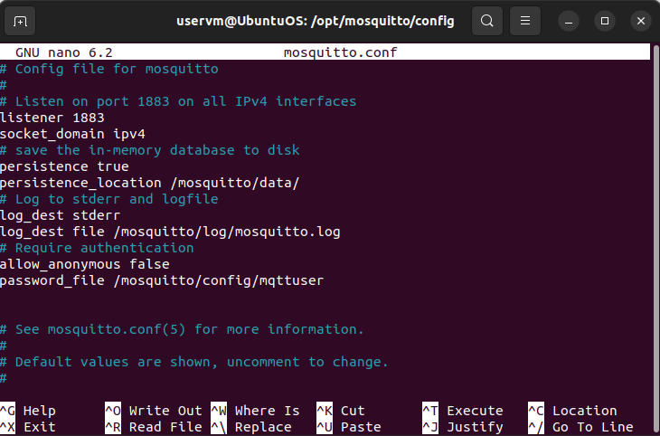
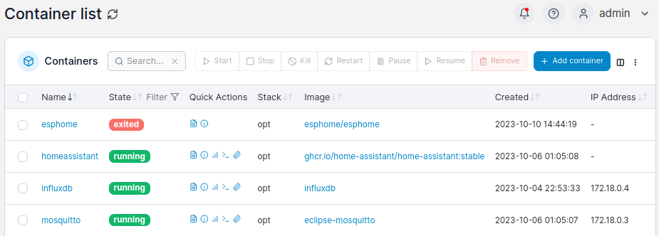
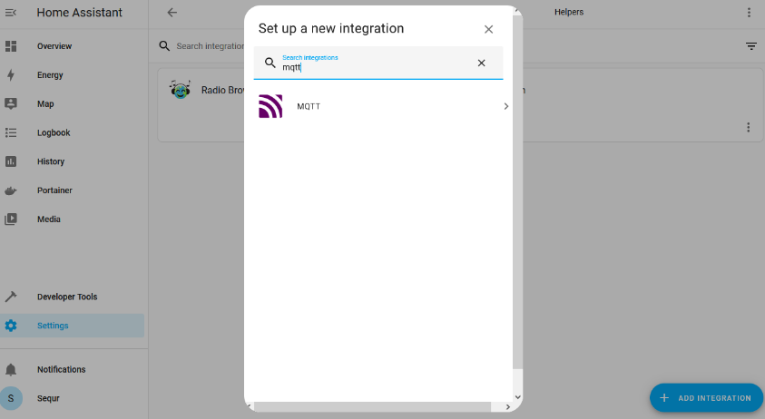
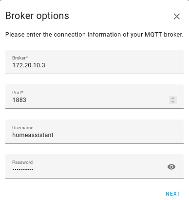
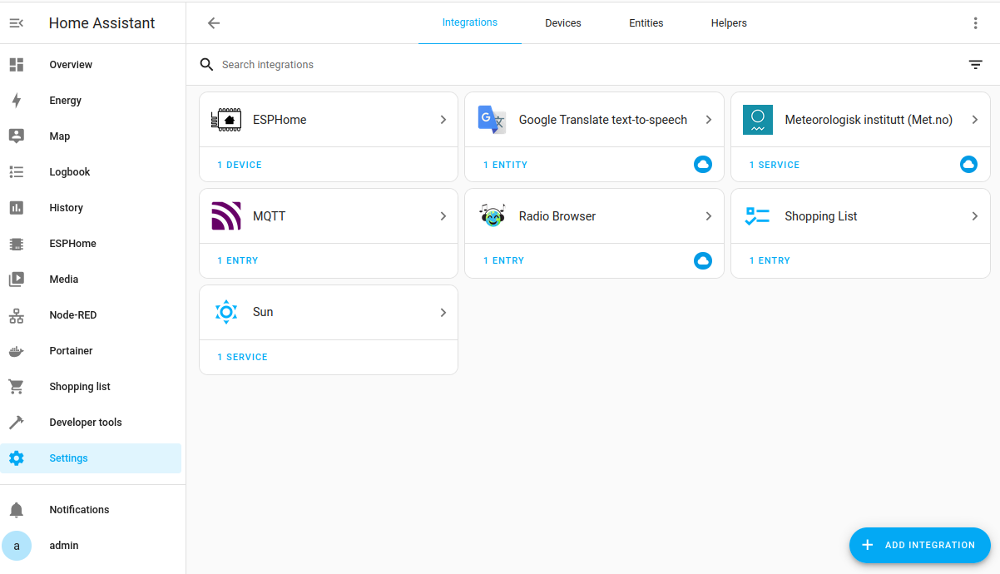

# ติดตั้ง Mosquitto Docker Container    
### Intro  
ในส่วนนี้ เราจะทำการเพิ่มส่วน Mosquitto MQTT ซึ่งจะทำให้เราสามารถเชื่อมต่อกับ อุปกรณ์ได้หลากหลาย  

### Install Mosquttio MQTT broker  
#### Docker-compose  
โดยที่เราจะทำการเริ่มต้น ด้วยการเพิ่มการกำหนดค่า config ที่ไฟล์ docker-compose.yaml  

```
services:
  [...]
  homeassistant:
    [...]
    depends_on:
      - influxdb
      - mosquitto
  
  mosquitto:
    container_name: mosquitto
    image: eclipse-mosquitto
    restart: unless-stopped
    ports:
      - "1883:1883/tcp"
    environment:
      - TZ=Europe/Brussels
    volumes:
      - /opt/mosquitto/config:/mosquitto/config
      - /opt/mosquitto/data:/mosquitto/data
      - /opt/mosquitto/log:/mosquitto/log
    stdin_open: true
    tty: true
```

เราได้ทำการเพิ่มบรรทัด stdin_open และ tty เพื่อให้เราสามารถเชื่อมต่อกับ terminal ของ container เพื่อรันคำสั่งได้ในภายหลัง  
ซึ่งเรายังสามาถเพิ่ม dependency บน Mosquitto container สำหรับ  Home Assistant container ของเราได้ด้วย ซึ่งด้วยวิธีนี้ เมื่อ Broker ของเรา ออนไลน์ ก่อนที่ Home Assistant จะเริ่มการทำงาน เราจะแน่ใจได้ว่า การทำเชื่อมต่อของเราจะไม่ล้มเหลว  

#### Mosquitto.conf  
เมื่อเราเปิด Mosquitto container โดยใช้ docker-compose up-d ผลลัพธ์จะแสดงให้เห็นถึง Unable to open config file /mosquitto/config/mosquitto.conf เพื่อแก้ไขสิ่งนี้เราสามารถทำการ ดาวน์โหลดไฟล์ default config และจัดเก็บไปที่ directory ของ config ที่ถูกสร้างขึ้นใหม่  

```
cd /opt/mosquitto/config/
sudo wget https://raw.githubusercontent.com/eclipse/mosquitto/master/mosquitto.conf
```
ต่อไปเราจะสามารถทำการแก้ไข หรือ เพิ่มบรรทัดต่อไปนี้ เนื่องจากการตั้งค่าทั้งหมดจะถูกใส่เครื่องหมาย # comment ไว้ เพราะเป็นค่าเริ่มต้น    

```
sudo nano mosquitto.conf
# add the following lines at the end

# Listen on port 1883 on all IPv4 interfaces
listener 1883
socket_domain ipv4
# save the in-memory database to disk
persistence true
persistence_location /mosquitto/data/
# Log to stderr and logfile
log_dest stderr
log_dest file /mosquitto/log/mosquitto.log
# Require authentication
allow_anonymous false
password_file /mosquitto/config/mqttuser
```
<p align="center">
  
</p>  

<p style="text-align: center;">ภาพตัวอย่างการแก้ไขไฟล์ mosquitto.conf </p>  

#### Mosquitto users  
ในขั้นตอนนี้ เราจะทำการสร้าง ผู้ใช้ สำหรับ Home Assistant เพื่อเชื่อต่อกับ Broker  
โดยเราจะรัน คำสั่งต่อไปนี้ เพื่อสร้างผู้ใช้  homeassistant ซึ่ง -c จะเป็นการสร้างไฟล์รหัสผ่านใหม่และทำการเขียนทับไฟล์ที่มีอยู่แล้ว ดังนั้นหากต้องการสร้างบัญชีอื่นๆ ให้ข้ามขั้นตอนนี้ไป  

```
docker exec -it mosquitto mosquitto_passwd -c /mosquitto/config/mqttuser homeassistant
```

หากเราทำการตรวจสอบเนื้อหาไฟล์ mqttuser ที่ถูกสร้างขึ้นใหม่ เราจะพบกับชื่อผู้ใช้และรหัสผ่านที่ถูก hash แล้ว  

```
sudo cat /opt/mosquitto/config/mqttuser
homeassistant:$7$101$q7VtJJ/E*******7$1I******************************************b/G**************************************A==
```

#### Restart Mosquitto  
ตอนนี้เราสามารถ ทำการ restart Mosquitto container ได้แล้วเพื่อทำการอับเดตการเปลี่ยนแปลงของเรา  

```
docker compose restart mosquitto
```
โดยไฟล์ log ของเราจะทำการบันทึกค่า ว่า Mosquitto container ได้ทำการเริ่มต้นขึ้นแล้ว  

```
sudo cat /opt/mosquitto/log/mosquitto.log
1662413136: mosquitto version 2.0.18 starting
1662413136: Config loaded from /mosquitto/config/mosquitto.conf.
1662413136: Opening ipv4 listen socket on port 1883.
1662413136: mosquitto version 2.0.18 running
```

<p align="center">
  
</p>  

<p style="text-align: center;">ภาพตัวอย่าง Mosquitto container running</p>

### Configure MQTT in Home Assistant  
ซึ่งในตอนนี้เราสามารถ เชื่อมต่อกับ Home Assistant กับ Broker MQTT ของเราได้แล้ว เพื่อให้สามารถรับ topics และส่ง messages ได้ เนื่องจากยังไม่มี MQTT clients อื่นที่เชื่อมต่อ Home Assistant จะทำการเพิ่มดังนี้  

<p align="center">
  
</p>  

<p style="text-align: center;">ภาพตัวอย่างการเพิ่ม MQTT integration</p>  

เราจะเพิ่ม MQTT integration ใหม่เข้ากับ Home Assistant และ ทำการป้อนข้อมูล ที่เราได้ทำการตั้งค่าไว้ ซึ่งจะต้องตรวจสอบว่า เราป้อน IP address ของ Docker ของเรา  

<p align="center">
  
</p>  

<p style="text-align: center;">ภาพตัวอย่างการป้อนข้อมูล HA MQTT</p>  

โดยในไฟล์ log เราจะแสดง MQTT container ของเราที่แสดงว่า Home Assistant ทำการเชื่อมต่อสำเร็จแล้ว  

```
sudo cat /opt/mosquitto/log/mosquitto.log
1662413136: mosquitto version 2.0.18 running
1662414198: New connection from 172.18.0.1:43153 on port 1883.
1662414198: New client connected from 172.18.0.1:43153 as 4atvQWWEyf2XpG3yy0kgOW (p1, c1, k60, u'homeassistant').
1662414198: Client 4atvQWWEyf2XpG3yy0kgOW disconnected.
1662414198: New connection from 172.18.0.1:39605 on port 1883.
1662414198: New client connected from 172.18.0.1:39605 as 5gNbahjfE5DulEufquYcaa (p2, c1, k60, u'homeassistant').
```


<p align="center">
  
</p>  

<p style="text-align: center;">ภาพตัวอย่าง MQTT integration ถูก set up</p> 

#### [Back to Homepage](https://tunlaya-sanphokha.github.io/Project-Logbook.github.io/index.html)
