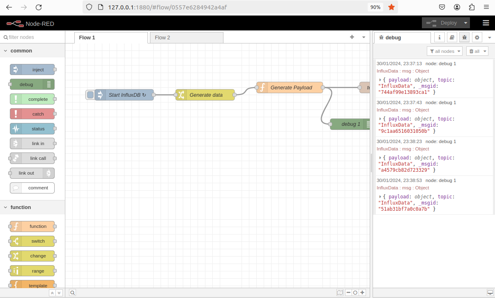
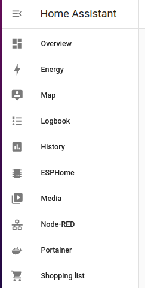
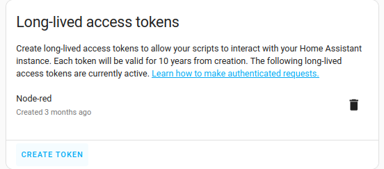
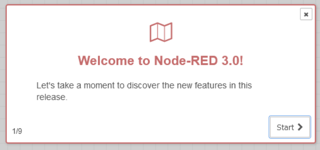
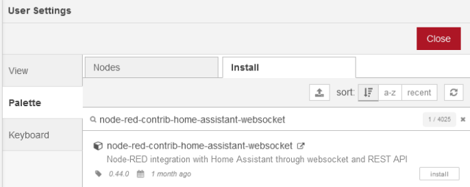
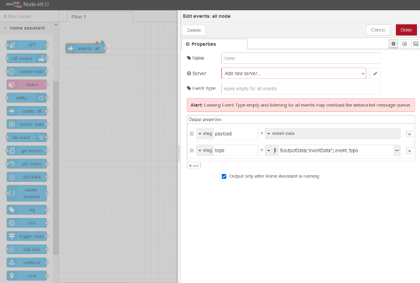
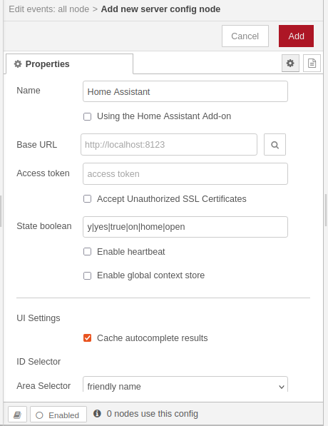
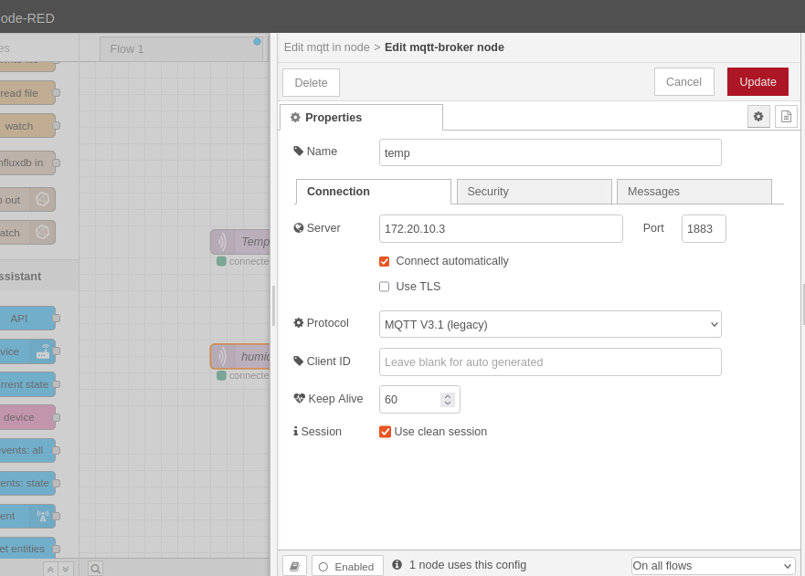

# ติดตั้ง Node-Red    

### ติดตั้ง Node-Red container  
#### Docker-compose  
เราขยาย docker-compose.yaml ด้วยการกำหนดค่าสำหรับ  Node-Red container  

```
services:
  [...]
  
  nodered:
    container_name: nodered
    image: nodered/node-red
    restart: unless-stopped
    ports:
      - "1880:1880/tcp"
    environment:
      - TZ=Europe/Brussels
    volumes:
      - /opt/nodered/data:/data
    depends_on:
      - homeassistant
      - mosquitto
```
เนื่องจากระบบ Node-Red ต้องอาศัย Home Assistant และเราอาจทำบางอย่างผ่าน MQTT จึงต้องมีความแน่ใจว่าว่า HA container ของเราและ broker Mosquitto ทำงานอยู่  

### File permissions  
หากตอนนี้เราทำการเปิดตัว Node-Red container โดยใช้ docker-compose up -d nodered เราจะสั่งเกตได้ว่า เราจะไม่สามารถเปิดเว็บ interface ที่ http://<ip.of.our.box>:1880  
เราจะตรวจสอบบันทึกใน Portainer หรือ จะรัน docker logs nodered จะสามารถสังเกตข้อผิดพลาดได้ดังนี้  
```
docker logs nodered

Error: EACCES: permission denied, copyfile '/usr/src/node-red/node_modules/node-red/settings.js' -> '/data/settings.js'
    at Object.copyFileSync (node:fs:2817:3)
    at copyFile (/usr/src/node-red/node_modules/fs-extra/lib/copy/copy-sync.js:73:6)
    at onFile (/usr/src/node-red/node_modules/fs-extra/lib/copy/copy-sync.js:59:25)
    at getStats (/usr/src/node-red/node_modules/fs-extra/lib/copy/copy-sync.js:51:44)
    at handleFilterAndCopy (/usr/src/node-red/node_modules/fs-extra/lib/copy/copy-sync.js:36:10)
    at Object.copySync (/usr/src/node-red/node_modules/fs-extra/lib/copy/copy-sync.js:29:10)
    at Object.<anonymous> (/usr/src/node-red/node_modules/node-red/red.js:129:20)
    at Module._compile (node:internal/modules/cjs/loader:1105:14)
    at Object.Module._extensions..js (node:internal/modules/cjs/loader:1159:10)
    at Module.load (node:internal/modules/cjs/loader:981:32) {
  errno: -13,
  syscall: 'copyfile',
  code: 'EACCES',
  path: '/usr/src/node-red/node_modules/node-red/settings.js',
  dest: '/data/settings.js'
}
node:internal/fs/utils:345
    throw err;
    ^
```
สิ่งนี้จะเกี่ยวกับวิธีการทำงานของ mapping ของ user ภายใน และ ภายนอก docker container  
Docker volume ของเราสำหรับ directory ที่ถูกสร้างขึ้นโดย root user ,โดย ID  uid=0 gid=0 คือผู้ใช้ nodered ภายใน container ซึ่งเป็นเจ้าของ directory /data แต่จะมี ID ที่แตกต่างกัน IDs: 1000:1000 (uid:gid) เราสามารถแก้ไขโดยเปลี่ยนความเป็นเจ้าของ Docker volume ที่มีผู้ใช้ ID 1000:1000 โดยการเรียกใช้ sudo chown -R 1000:1000 /opt/nodered/data  
หลังจากนั้น docker จะเห็นถึงความเปลี่ยนแปลงในการอนุญาตและจะ restart ขึ้นใหม่จาก Portainer interface  

```
ตอนนี้เราสามารถ เปิด Node-Red interface ได้แล้วที่
http://<ip.of.our.box>:1880
```
<p align="center">
  
</p>    

<p style="text-align: center;">ภาพตัวอย่าง Node-Red interface</p>

### Home Assistant config  
#### Sidebar  
เราสารมารถเพิ่ม Node-Red ลงในแถบด้านข้างของ dashboard Home Assistant ได้โดยใช้ panel-iframe ทำให้เข้าถึง Node-Red ได้ง่ายขึ้น  

เพิ่ม code ต่อไปนี้ใน configuration.yaml  

```
panel_iframe:
  portainer:     
    [...]
  nodered:
    title: Node-RED
    icon: mdi:lan
    url: http://172.20.10.3:1880/
    require_admin: true
```
หลังจากนั้นทำการ restart Home Assistant ผ่านเมนู developer Tools จากนั้นเราจะเห็น Node-Red ปรากฏอยู่ในแถบด้านข้าง  

<p align="center">
  
</p>    

<p style="text-align: center;">ภาพตัวอย่าง Node-Red สามารถเข้าถึงได้จากแถบด้านข้าง</p>  

### Access Token  
โดยในขั้นตอนต่อไปเราจะทำการตั้งค่า Node-Red เพื่อให้สามารถเชื่อมต่อกับ Home Assistant ได้ โดยการตั้งค่าการเชื่อมต่อนี้ เราจะเป็นต้องมี Long-Lived Access Tokens  
ดังนั้น ให้ทำการ คลิกไปที่ผู้ใช้ของเรา ที่แถบด้านล่างของ Home Assistant แล้วเลื่อนหาไปที่ Long-Lived Access Tokens  

<p align="center">
  
</p>    

<p style="text-align: center;">ภาพตัวอย่างการสร้าง long-lived access tokens</p>  

คลิกสร้าง Token แล้วป้อนชื่อ เช่น Node-Red แล้วทำการ คัดลอก Access Tokens เก็บไว้ เนื่องจากเราจำเป็นต้องใช้ Access Tokens ในภายหลัง  

### Node-RED configuration  
ทำการเปิด Node-Red interface ผ่าน Dashboard Home Assistant หรือ จะเปิดที่ browser http://<ip.of.our.box>:1880  

<p align="center">
  
</p>    

<p style="text-align: center;">ภาพตัวอย่าง Node-Red Welcome</p>  

### Home Assistant nodes  
ก่อนอื่นเราจะทำการเพิ่ม node Home Assistant ให้กับ Node-Red  
1.เปิดเมนูที่มุมบนขวา แล้วคลิกที่ Manage Palette เพื่อดูภาพรวมของ node ที่ถูกติดตั้งอยู่แล้ว  
2.เปิดหน้า install  
3.ค้นหาและทำการติดตั้ง node-red-contrib-home-assistant-websocket  

<p align="center">
  
</p>    

<p style="text-align: center;">ภาพตัวอย่างการติดตั้ง HA Websockets ใน Palette</p>  

ต่อไปเราต้องตั้งค่าการเชื่อมต่อระหว่าง Node-Red และ Home Assistant  
1.กลับไปที่หน้า flow editor ให้ลาก events:all node จาก Home Assistant แล้วไปยัง editor  
2.คลิกสองครั้งที่ node เพื่อทำการกำหนดค่า configuration  
3.เลือกที่ Add new server.. แล้วคลิกที่ ไอคอนดินสอ  
4.ทำการตั้งชื่อ การกำหนดค่า server เช่น Home Assistant  
5.อย่าตรวจสอบ Using the Home Assistant Add-on  
6.ถัดจาก URL ให้ทำการป้อนชื่อ address ที่ใช้ในการเช้าถึง Home Assistant  
7.ทำการใช้ Tokens ที่เราได้ทำการสร้างไว้ จาก Home Assistant  
8.ทำการ Add,Save และ Deploy เพื่อ store การกำหนดค่า server config  

<p align="center">
  
</p>    

<p style="text-align: center;">ภาพตัวอย่างการตั้งค่าการเชื่อมต่อกับ HA server</p>  

<p align="center">
  
</p>    

<p style="text-align: center;">ภาพตัวอย่างการป้อนรายละเอียด server</p>  

จากนี้ไป เราจะสามารถเชื่อมต่อสื่อสารกับ Home Assistant จาก Node-Red ซึ่งเราสามารถ listen การเปลี่ยนแปลง state และ call server โดยผ่าน Home Assistant ได้    

### MQTT and Node-RED  
ในส่วนนี้เราจะทำการตั้งค่าการเชื่อมต่อจาก Node-Red ไปยัง MQTT broker ของเราด้วย เพื่อให้สามารถสื่อสารกับอุปกรณ์ผ่าน MQTT จาก Node-Red ได้โดยตรง  

#### MQTT user  
โดยเราจะทำการสร้าง MQTT user เพิ่มเติมสำหรับ Node-Red โดยสิ่งนี้จะทำให้เราสามารถติดตามการสื่อสารจาก Node-Red ใน Mosquitto logs ได้  
เปิดหน้าต่าง terminal เชื่อมต่อกับ Docker และ รันคำสั่งต่อไปนี้  

```
docker exec -it mosquitto mosquitto_passwd /mosquitto/config/mqttuser nodered
# Enter a password
```

### Node-RED setup  
ซึ่งในการตั้งค่านี้จะคล้ายๆกับการตั้งค่าการเชื่อมต่อ Home Assistant ข้อแตกต่างคือเราไม่ต้องเพิ่ม package เนื่องจาก MQTT จะ support ค่า default  
1.Add MQTT node  
2.Double-click เพื่อเปิดการตั้งค่า configuration  
3.Add new MQTT server  
4.ใน tab Connection กรอก server address (ip.of.our.box) และ Port (1883) ของ broker ของเรา และเลือก cilent ID หรือ Node-Red generate แบบสุ่ม โดยสามารถเลือก MQTT V5 ได้หากเราต้องการให้ Mosquitto support ทั้งสองอย่าง แต่ในที่นี้เราได้ทำการเลือกเป็น MQTT V3.1 Protocal  

5.ใน tab Security ให้ป้อนชื่อ username และ password สำหรับ MQTT user ที่เราเพิ่งสร้างขึ้น  
6.ทำการ Add,Save และ deploy เพื่อจัดเก็บการเปลี่ยนแปลง  

<p align="center">
  
</p>    

<p style="text-align: center;">ภาพตัวอย่างการป้อนรายละเอียด server</p>  

เมื่อเสร็จสิ้นแล้ว เราจะสามารถ setup flows และ สามารถเชื่อมต่อสื่อสารโดยตรงกับ MQTT broker ของโดยไม่ผ่าน HA


#### [Back to Homepage](https://tunlaya-sanphokha.github.io/Project-Logbook.github.io/index.html)
