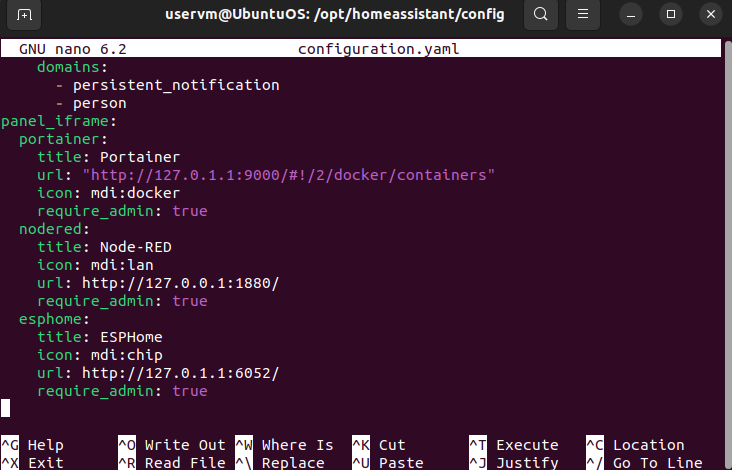

# ติดตั้ง ESPHome  
### Install ESPHome container  
#### Docker-compose  
เราจะทำการเพิ่มการกำหนด config สำหรับ ESPHome container ในไฟล์ docker-compose.yaml เหมือนเช่นที่ผ่านมา โดยเพิ่ม code ดังนี้   

```
services:
  [...]

  esphome:
    container_name: esphome
    image: esphome/esphome
    restart: unless-stopped
    ports:
      - "6052:6052/tcp"
    environment:
      - TZ=Europe/Brussels
    # mDNS doesn't work across VLANs, use static IP for devices when disabling mDNS
    #   - ESPHOME_DASHBOARD_USE_PING=true
    volumes:
      - /opt/esphome/config:/config
      - /etc/localtime:/etc/localtime:ro
    # devices:
    #   - /dev/ttyUSB0:/dev/ttyUSB0
    network_mode: host
```

### Start and access ESPHome  

หากเราทำการรัน docker-compose up -d Docker จะทำการดึง image และ เปิดใช้งาน  
เมื่อทำงานแล้ว เราจะสามารถเข้าถึง dashboard ESPHome ได้ที่ http://<ip.of.our.box>:6052  

### Home Assistant Sidebar  
ในส่วนนี้เราจะทำการเพิ่มแถบรายการสำหรับ ESPHome ลงในแถบด้านข้างของ dashboard Home Assistant โดยใช้ panel-iframe  
เราจะทำการเพิ่มบรรทัดต่อใน configuration.yaml  

```
panel_iframe:
  portainer:     
    [...]
  nodered:      
    [...]
  esphome:
    title: ESPHome
    icon: mdi:chip
    url: http://192.168.10.106:6052
    require_admin: true
```

<p align="center">
  
</p>    

<p style="text-align: center;">ภาพตัวอย่าง code panel-iframe</p>  

หลังจาก reboot เราจะสามารถเข้าถึง ESPHome ได้จากแถบด้านข้าง Home Assistant Dasdboard  

<p align="center">
  
</p>    

<p style="text-align: center;">ภาพตัวอย่าง ESPHome dasdboard</p>  

#### [Back to Homepage](https://tunlaya-sanphokha.github.io/Project-Logbook.github.io/index.html)  
