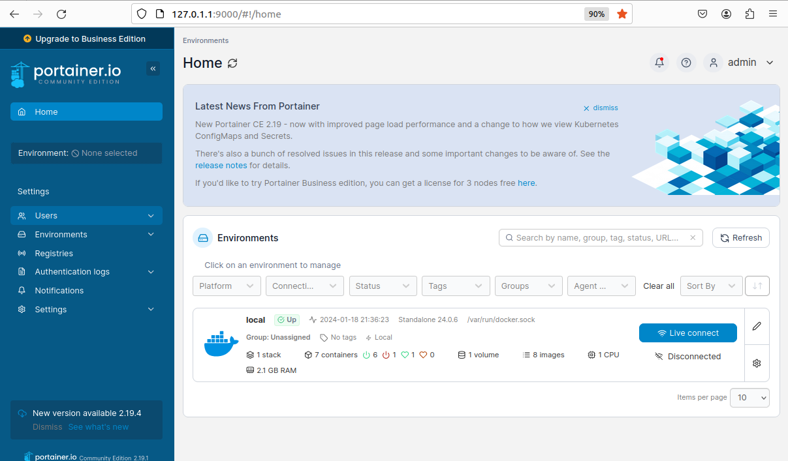

# ติดตั้ง Docker and Portainer  


### ติดตั้ง Docker  
ในที่นี้เราไม่ได้ทำการติดตั้ง Docker Desktop  แต่จะทำการติดตั้ง Docker Engine บน Ubuntu แทน  

โดยสามารถอ่านเอกสารได้เพิ่มเติม [ Docker Engine](https://docs.docker.com/engine/install/debian/)   

โดยจะเริ่มต้นทำการติดตั้งดังนี้  เพื่อเป็นการอัปเดตแพคเกจและติดตั้งแพคเกจในระบบ Ubuntu  

```
sudo apt-get update
sudo apt-get install \
    ca-certificates \
    curl \
    gnupg \
    lsb-release
```
ทำการเพิ่ม  Docker repositor โดยใช้คำสั่งดังต่อไปนี้  
```
sudo mkdir -p /etc/apt/keyrings
curl -fsSL https://download.docker.com/linux/debian/gpg | sudo gpg --dearmor -o /etc/apt/keyrings/docker.gpg
echo \
  "deb [arch=$(dpkg --print-architecture) signed-by=/etc/apt/keyrings/docker.gpg] https://download.docker.com/linux/debian \
  $(lsb_release -cs) stable" | sudo tee /etc/apt/sources.list.d/docker.list > /dev/null
```
และทำการ ติดตั้ง Docker Engine  
```
sudo apt-get update
sudo apt-get install docker-ce docker-ce-cli containerd.io docker-compose-plugin
```
### ติดตั้ง Docker Compose  
เอกสารประกอบของ [Docker Compos](https://docs.docker.com/compose/install/) จะให้เราทำการติดตั้ง Docker Desktop  
ซึ่งเราไม่จำเป็นต้องดาวน์โหลด Docker Compose จาก [GitHub](https://github.com/docker/compose/releases)   
เนื่องจากจริงๆ แล้วมันถูกรวมไว้ระหว่างการติดตั้ง Docker Engine สิ่งเดียวที่เราต้องทำคือทำการเชื่อมโยงไปยังไฟล์ปฏิบัติการและให้สิทธิ์ในการดำเนินการ โดยใช้คำสั่งต่อไปนี้  

```
sudo ln -s /usr/libexec/docker/cli-plugins/docker-compose /usr/bin/docker-compose
sudo chmod u+x /usr/bin/docker-compose
```
### Setting up permissions
ต่อไปเราจะทำการตั้งค่า เพื่ออนุญาตให้ผู้ใช้ที่ไม่ใช่ผู้ดูแลระบบ (ในที่นี้จะตั้งชื่อว่า sysadmin) เพื่อดำเนินการรูทโดยใช้ sudo และเรียกใช้ docker และ docker-compose  
```
su # enter root password
# install sudo
apt install sudo
gpasswd -a sysadmin sudo
# add sysadmin to docker group
gpasswd -a sysadmin docker
```
เข้าสู่ระบบในฐานะผู้ใช้ที่ไม่ใช่ผู้ดูแลระบบอีกครั้งเพื่อให้เกิดเปลี่ยนแปลงที่ได้ตั้งค่าไว้

### ติดตั้ง Portainer
#### docker-compose.yaml  
ในการติดตั้ง Portainer เราจะทำการสร้าง docker-compose script เพื่อที่เราจะสามารถเปิดใช้งานเพื่อไว้ตั้งค่า ทุกๆอย่าง ในนี้ 

```
cd /opt
sudo nano docker-compose.yaml  # or file editor of choice
# Edit file, see below
# Save and Close via Ctrl+O and Ctrl+X

```
นอกจากนี้ เราจะทำการกำหนดค่า Docker config และ vulumes ใน โฟลเดอร์ /opt ทำให้การสำรองข้อมูลทุกอย่างง่ายขึ้น volumes เหล่านี้จะจัดเก็บข้อมูลจาก Docker image ไว้ในเครื่องดังนั้นข้อมูญจะไม่สูญหายเมื่อ มีการสร้าง container ขึ้นใหม่  

บางครั้งเราอาจจะต้องเปิดเผย local file, socket หรือ device ไปยัง Docker container เพื่อให้สามารถเข้าถึง file/socket/device ดังกล่าวได้ เราจะต้องทำการเปิดเผยไฟล์ที่เก็บการตั้งค่า local time ให้กับ Portainer รู้ว่าเป็นเวลาใด (สำหรับ log timestamps) รวมถึง socket ที่ควบคุม Docker เพื่อให้ Container สามารถดำเนินการใน Docker ได้  
```
version: '3.0'

services:
  portainer:
    container_name: portainer
    image: portainer/portainer-ce:latest
    restart: unless-stopped
    ports:
      - "9000:9000/tcp"
      - "9443:9443/tcp"
    environment:
      - TZ=Europe/Brussels
    volumes:
      - /etc/localtime:/etc/localtime:ro
      - /var/run/docker.sock:/var/run/docker.sock
      - /opt/portainer/data:/data

```  
### Permissions  
นอกจากนี้ เรายังจะสามารถอนุญาตให้ ผู้ใช้ที่ไม่ใช่ผู้ดูแลระบบแก้ไขไฟล์นี้ได้ โดยผ่านคำสั่งดังนี้
```  
sudo chown root:docker docker-compose.yaml
sudo chmod g+w docker-compose.yaml
```
### Check config  
เนื่องจากเราต้องการให้แน่ใจ ว่า สามารถใช้งาน และไม่ได้ทำอะไรผิดพลาดใน docker-compose.yaml เราจะทำการเรียกใช้คำสั่งต่อไปนี้ จากนั้น Docker จะแสดงสิ่งที่จะทำงาน รวมถึงข้อผิดพลาดในการ กำหนดค่า และคำเตือนที่เกี่ยวข้อง
```
docker-compose -f docker-compose.yaml config
```
### Launch  
ตอนนี้เมื่อเราทำการรัน docker-compose up -d และ Docker จะดาวน์โหลด Portainer image ล่าสุด และตั้งค่าทุกอย่าง เมื่อเสร็จแล้วเราจะสามารถเปิด Portainer web interface ได้โดยไปที่ http:/ /<ip.of.our.box>:9000 จะแสดงหน้าเว็บดังนี้
<p align="center">
  
</p>  

<p style="text-align: center;">ภาพตัวอย่าง Portainer</p>  

#### [Back to Homepage](https://tunlaya-sanphokha.github.io/Project-Logbook.github.io/index.html)  


