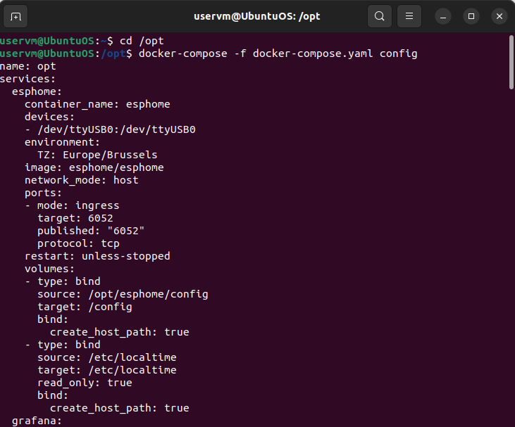
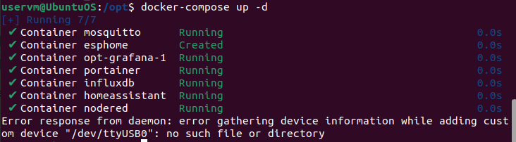
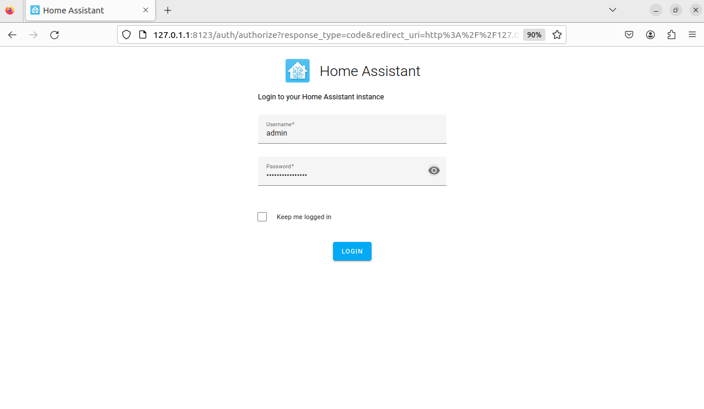
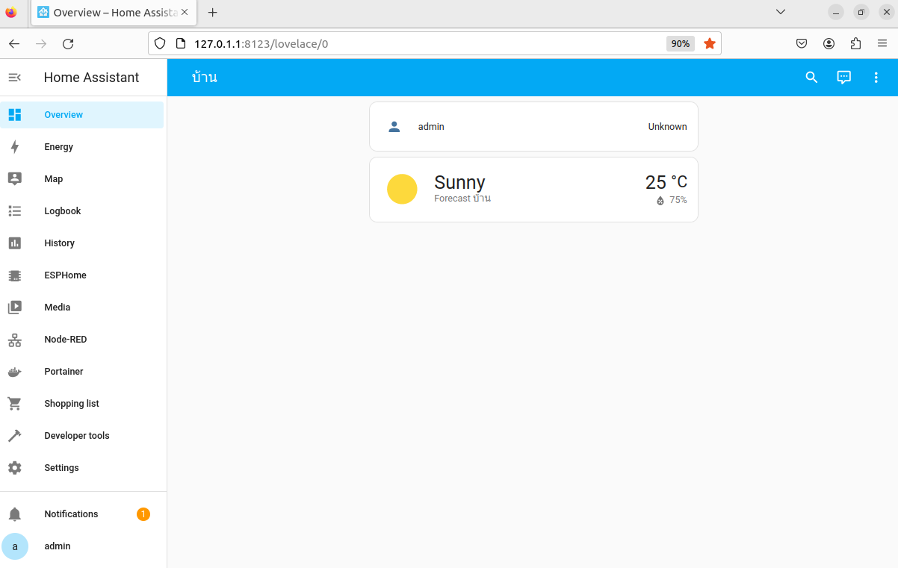

# Install Home Assistant Container
### Intro  
ในส่วนนี้ เราจะทำการตั้งค่า Home Assistant Container ขั้นพื้นฐาน โดยใช้ docker-compose  
### Install Home Assistant Container  
#### docker-compose.yam
การติดตั้ง โดยใช้ docker-compose จะเป็นไปตามเอกสารประกอบ [ HA Container documentation](https://www.home-assistant.io/installation/linux#install-home-assistant-container)  

ใน Docker เราจะเพิ่มรายการสำหรับ Home Assistant Contaoner ในไฟล์ docker-compose.yaml โดยจะทำการเพิ่มการตั้งค่าไว้ดังนี้ และควรระมัดระวังการเยื่องของบรรทัด 

```
cd /opt
sudo nano docker-compose.yaml
```
```
version: '3.0'

services:
  [...]
  homeassistant:
    container_name: homeassistant
    image: "ghcr.io/home-assistant/home-assistant:stable"
    restart: unless-stopped
    environment:
      - TZ=Europe/Brussels
    volumes:
      - /opt/homeassistant/config:/config
      - /etc/localtime:/etc/localtime:ro
    privileged: true
    network_mode: host
```
ภาพตัวอย่าง ไฟล์ docker-compose.yaml  
<p align="center">
  
</p>

### Check config  
ทำการ Check config โดยฝช้คำสั่ง ดังนี้  

```
docker-compose -f docker-compose.yaml config 
```

ถ้าไม่มี error หรือ คำเตือน จะแสดงดังนี้  

```
docker-compose -f docker-compose.yaml config

name: opt
services:
  homeassistant:
    container_name: homeassistant
    environment:
      TZ: Europe/Brussels
    image: ghcr.io/home-assistant/home-assistant:stable
    network_mode: host
    privileged: true
    restart: unless-stopped
    volumes:
    - type: bind
      source: /opt/homeassistant/config
      target: /config
      bind:
        create_host_path: true
    - type: bind
      source: /etc/localtime
      target: /etc/localtime
      read_only: true
      bind:
        create_host_path: true
  portainer:
    container_name: portainer
    environment:
      TZ: Europe/Brussels
    image: portainer/portainer-ce
    networks:
      default: null
    ports:
    - mode: ingress
      target: 9000
      published: "9000"
      protocol: tcp
    restart: unless-stopped
    stdin_open: true
    tty: true
    volumes:
    - type: bind
      source: /etc/localtime
      target: /etc/localtime
      read_only: true
      bind:
        create_host_path: true
    - type: bind
      source: /var/run/docker.sock
      target: /var/run/docker.sock
      bind:
        create_host_path: true
    - type: bind
      source: /opt/portainer/data
      target: /data
      bind:
        create_host_path: true
networks:
  default:
    name: opt_default
```

ภาพตัวอย่างการใช้ คำสั่ง docker-compose -f docker-compose.yaml config  
<p align="center">
  
</p>  

### Launch container  
โดยเราจะต้องทำการสร้าง config directory ที่เราจะใช้ในการกำหนดค่า และ เรียกใช้ docker-compose  

```  
cd /opt
sudo mkdir -p homeassistant/config
docker-compose up -d  
```
  
โดยตอนนี้ Docker จะทำการ pull Home Assistant image และจะตั้งค่าทุกอย่าง โดยอาจจะใช้เวลาสักครู่ 
ภาพตัวอย่างการเรียกใช้คำสั่ง docker-compose up -d   

***เนื่องจากทางผู้จัดทำได้ทำการติดตั้งไว้แล้ว จึงแสดงการ running ได้ดังนี้*** 
<p align="center">
  
</p>  

###  Set up Home Assistant  

ตอนนี้ container เริ่มการทำงานแล้ว เราจะทำการ ตั้งค่า login Home Assistant   

ทำการเปิด browser และไปที่ http://<ip.of.our.box>:8123  
ภาพแสดงหน้าเว็บ Home Assistant 

<p align="center">
  
</p>  

ทำการตั้งค่าชื่อผู้ใช้ และ รหัสผ่านสำหรับบัญชี Home Assistant ซึ่งบัญชีนี้จะเป็น บัญชี "admin"  โดยเราสามารถตั้งค่าโซนบ้าน และ ข้อมูลใดๆก็ตามที่ต้องการแชร์ หรือ ข้อมูลที่ต้องการปรับปรุงใน Home Assistant   

เมื่อทำการตั้งค่าเสร็จแล้ว สามารถไปที่ Home Assistant Dashboard หากเรามีการกำหนดค่าอุปกรณ์ หรือ ข้อมูลใดๆ ในขั้นตอนก่อนหน้า จะแสดงบน Dashboard นี้  

ภาพแสดงหน้า Dashboard ของ Home Assistant 

<p align="center">
  
</p>  


