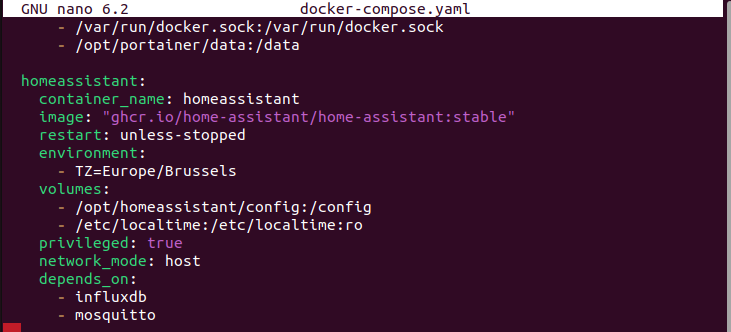

# Install Home Assistant Container
### Intro  
ในส่วนนี้ เราจะทำการตั้งค่า Home Assistant Container ขั้นพื้นฐาน โดยใช้ docker-compose  
### Install Home Assistant Container  
#### docker-compose.yam
การติดตั้ง โดยใช้ docker-compose จะเป็นไปตามเอกสารประกอบ [ HA Container documentation](https://www.home-assistant.io/installation/linux#install-home-assistant-container)  

ใน Docker เราจะเพิ่มรายการสำหรับ Home Assistant Contaoner ในไฟล์ docker-compose.yaml โดยจะทำการเพิ่มการตั้งค่าไว้ดังนี้ และควรระมัดระวังการเยื่องของบรรทัด 

```
cd /opt
sudo nano docker-compose.yaml
```
```
version: '3.0'

services:
  [...]
  homeassistant:
    container_name: homeassistant
    image: "ghcr.io/home-assistant/home-assistant:stable"
    restart: unless-stopped
    environment:
      - TZ=Europe/Brussels
    volumes:
      - /opt/homeassistant/config:/config
      - /etc/localtime:/etc/localtime:ro
    privileged: true
    network_mode: host
```
ตัวอย่าง  
<p align="center">
  
</p>

### Check config  

