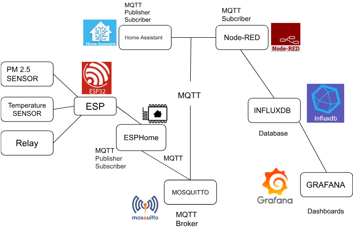
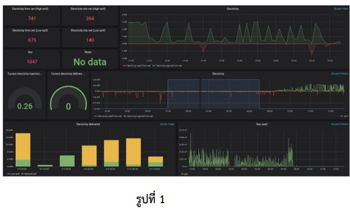
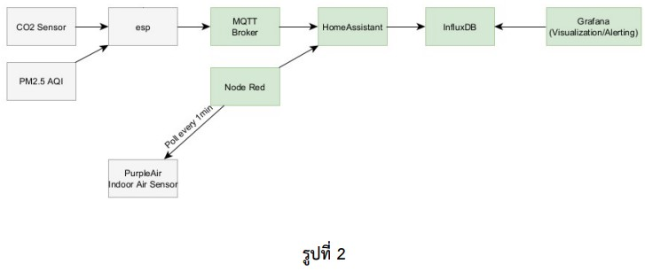

# Design and Development of a Web-based Application for Smart Home
## การออกแบบและพัฒนาเว็บแสดงผลสำหรับข้อมูลของสมาร์ทโฮม
---
### __อาจารย์ที่ปรึกษา__
ดร.เรวัต ศิริโภคาภิรมย์ (rawat.s@eng.kmutnb.ac.th)   

ภาควิชาวิศวกรรมไฟฟ้าและคแมพิวเตอร์ (ECE) คณะวิศวกรรมศาสตร์ มจพ.  
### __ผู้จัดทำ__  
1. นางสาวตุลยา 	สารโพคา	 6201012620341  
1. นางสาวธตา	จำปาภา 	 6301012610035  
1. นายอินทัช	     	โรจนกร  	 6301012620201  

### __หลักการและเหตุผล__
สมาร์ทโฮม (Smart Home) เป็นตัวอย่างของระบบที่มีการประยุกต์ใช้งานเทคโนโลยี ด้าน IoT (Internet of Things) นอกจากแพลตฟอร์มของผู้ให้บริการเชิงพาณิชย์แล้ว เช่น Apple HomeKit, Amazon Echo, Samsung SmartThings แพลตฟอร์มสำหรับสมาร์ทโฮมที่ใช้ซอฟต์แวร์ประเภท Open Source เช่น Home Assistant กำลังได้รับความนิยมอย่างมาก ในกลุ่มผู้ใช้และสร้างระบบเองแบบ DIY

ตัวอย่างของซอฟแวร์ประเภท Open Source ที่เกี่ยวข้องกับการพัฒนาระบบสมาร์ทโฮมในปัจจุบัน ได้แก่ Home Assistant (HA), NodeRED, Mosquitto MQTT Broker, InfluxDB / Grafana และ ESPHome for ESP8266/ESP32 เป็นต้น และสามารถนำมาใช้งานร่วมกันตามตัวอย่างของสถาปัตยกรรมในรูปที่ 1 และ 2 และสามารถนำไปติดตั้งใช้งานในระบบคอมพิวเตอร์ขนาดเล็ก ใช้พลังงานต่ำได้ เช่น Raspberry Pi ซึ่งตัวอย่างของคอมพิวเตอร์บอร์ดเดี่ยวที่มีการใช้งานอย่างแพร่หลาย

วัตถุประสงค์ของโครงการนี้ ก็เพื่อออกแบบและพัฒนาระบบซอฟต์แวร์ในการแสดงผลข้อมูลจากอุปกรณ์เซนเซอร์ รวมถึงการศึกษาความเหมาะสมของการนำซอฟต์แวร์ตามที่ได้กล่าวไปมาประยุกต์ใช้งาน เปรียบเทียบกับการพัฒนาซอฟต์แวร์เอง ในรูปแบบ WebApp for Data Visualization ซึ่งเป็นอีกทางเลือกหนึ่ง

  

  

  

### __ขอบเขตของงานและขั้นตอนการดำเนินการ__

__ส่วนที่1__
* ศึกษาการติดตั้งและใช้งาน Docker Container บนคอมพิวเตอร์ที่ใช้ระบบ Linux (Ubuntu 64-bit) และบอร์ด Raspberry Pi4 (Raspbian OS 64-bit)
* ศึกษาวิธีการติดตั้งและใช้งานซอฟต์แวร์สำหรับ Smart Home Platform เช่น Home Assistant, MQTT Broker, NodeRED, InfluxDB/Grafana โดยใช้งานอยู่ใน Docker Containers และนำมาประยุกต์ใช้งานร่วมกัน
* ศึกษาและใช้งาน ESPHome สำหรับบอร์ด ESP8266/ESP32 และเลือกใช้อุปกรณ์เซนเซอร์หลายชนิดและสื่อสารด้วยเทคโนโลยีไร้สาย (เช่น WiFi/BLE) เพื่อนำมาใช้ร่วมกับ Home Asistant และซอฟแวร์ที่เกี่ยวข้อง
* ออกแบบระบบ Smart Home ในระดับสถาปัตยกรรมซอฟแวร์ โดยเลือกใช้องค์ประกอบทางซอฟแวร์ในประเภท Open Source ตามที่ได้ศึกษาไปในขั้นตอนก่อนหน้า
* ตั้งค่าการใช้งานซอฟต์แวร์ในส่วนต่างๆ และปรับแต่งส่วนแสดงผลบน Grafana Dashboard เพื่อนำข้อมูลมาจากอุปกรณ์เซนเซอร์มาแสดงผลอย่างเหมาะสมสำหรับอุปกรณ์แต่ละชนิด
* ทดสอบการทำงานของระบบโดยรวม และจัดทำเอกสารคู่มือการติดตั้งและใช้งานซอฟแวร์ รายงานความก้าวหน้า และรายงานฉบับสมบูรณ์

__ส่วนที่2__
* ศึกษาการเขียนโค้ดและพัฒนา WebApp โดยใช้ HTML5, JavaScript, WebSockets, MQTT over Websockets และ  WebGL
* ออกแบบและพัฒนา WebApp  ที่ประกอบด้วย Front-end และ Back-end (Python หรือ Nodejs-based) โดยโฟกัสที่การประยุกต์ใช้งาน WebGL for UI/Data Visualization และ WebSockets เพื่อจัดทำ UI เป็น Dashboard  แสดงข้อมูลจากอุปกรณ์เซนเซอร์ที่ได้มีการนำมาใช้งานในระบบ Smart Home
* ทดสอบการทำงานของระบบโดยรวม และจัดทำเอกสาร การติดตั้งและใช้งานซอฟต์แวร์ รายงานความก้าวหน้าและรายงานฉบับสมบูรณ์ 

<!-- __ข้อสังเกต__
* __งานส่วนที่1__ จะเกี่ยวข้องกับการศึกษาและใช้งานซอฟแวร์หลายชนิด ไม่เน้นเขียนโค้ด แต่จะเน้นที่การติดตั้งและตั้งค่าใช้งานซอฟแวร์ให้ถูกต้องและเหมาะสม เป็นงานในลักษณะ System Admin & Configuration และก็จะมีส่วนที่เกี่ยวข้องกับระบบสมองกลฝังตัวด้วย โดยสามารถใช้งาน ESPHome  ซึ่งทำให้ใช้งานได้ง่ายกว่าการเขียนโค้ดสำหรับบอร์ด ESP8266/ESP32 เองทั้งหมด
* __งานส่วนที่2__ จะเกี่ยวข้องกับการพัฒนาระบบ WebApp ซึ่งมีทั้ง Front-End และ Back-End (Fullstack) เพื่อจัดทำ Customized Dashboard แสดงข้อมูลจากอุปกรณ์เซนเซอร์ (เป็นตัวเลือกเชิงเปรียบเทียบกับการใช้ซอฟต์แวร์ เช่น Grafana แต่อาจจะดูซับซ้อนน้อยกว่า) ดังนั้นลักษณะของงานจึงจะเกี่ยวข้องเกี่ยวข้องกับการเขียนโค้ดมากกว่าส่วนที่ 1 และเป็นงานในลักษณะ Web App Development -->

### งานส่วนที่ 1

#### [ศึกษา Docker, Home assistant, Node-RED, MQTT, InfluxDB และ Grafana](https://tunlaya-sanphokha.github.io/Project-Logbook.github.io/link.html)
#### [ติดตั้ง Docker and Portainer](https://tunlaya-sanphokha.github.io/Project-Logbook.github.io/Install_DockerAndPortainer.html)
#### [ติดตั้ง Home Assistant Container](https://tunlaya-sanphokha.github.io/Project-Logbook.github.io/Install_HomeAssistantContainer.html)  
#### [ติดตั้ง InfluxDB](https://tunlaya-sanphokha.github.io/Project-Logbook.github.io/4_Install_InfluxDB.html)
