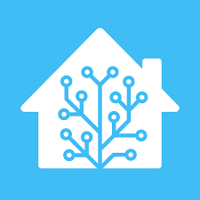
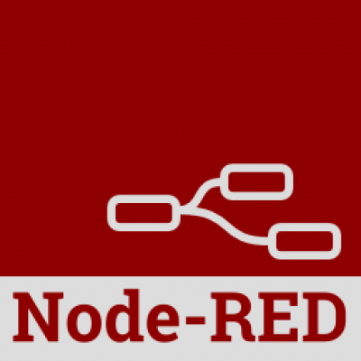
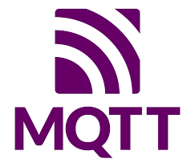

# ศึกษา Docker, Home assistant, Node-RED , MQTT , InfluxDB และ Grafana
### Docker  

  

Docker คือ เทคโนโลยี container ที่เอาไว้ช่วยให้เราสร้างและดำเนินการ application หรือ software ต่างๆ ที่ใช้ environment ที่แตกต่างกัน ใช้งานร่วมกันได้ง่ายยิ่งขึ้น ทำให้การพัฒนา software หรือ application ของเราทำได้ง่ายยิ่งขึ้น  

__ข้อดี__
* Open source: เป็น Open source ทำให้ไม่มีค่าใช้จ่ายในการใช้งาน
* Flexibility: ทำให้เราสามารถสร้างหรือใช้งาน application หรือ software ในสภาพแวดล้อมที่แตกต่างกันได้
* Easy to create and delete: docker ทำให้เราสามารถสร้างและลบ container ได้ง่ายและรวดเร็ว
* Seperate container: docker จะทำการแบ่งแยก container ของ application หรือ software ที่แตกต่างกัน ทำให้บำรุงรักษาได้ง่าย

__ข้อเสีย__  

* Complexity: มีความซับซ้อนใช้งานและในการ config container ทำให้อาจจะไม่เหมาะกับผู้ใช้ที่ไม่มีความรู้มาก่อน
* Container managment: หากเราสร้าง container หลาย container การที่จะจัดการ container เหล่านั้นก็จะมีความยุ่งยากยิ่งขึ้น

เมื่อเปรียบเทียบกับซอฟต์แวร์อื่นๆ ที่ทำหน้าที่คล้ายกัน เช่น Virtual Machines และ Emulators มักจะใช้ทรัพยากรมากกว่า Docker และใช้เวลาในการเริ่มต้นใช้งานและจบการทำงานนานกว่า นอกจากนี้ Docker ยังมีชุดเครื่องมือที่ใช้งานง่ายและเสถียรมากกว่าในการสร้างและเริ่มต้นคอนเทนเนอร์

### Home Assistant  

  

Home Assistant คือซอฟต์แวร์ที่ใช้สำหรับการควบคุมและจัดการ IoT  โดยทำหน้าที่เป็นตัวกลางที่สามารถเชื่อมต่อกับอุปกรณ์ต่าง ๆ เช่น หลอดไฟ สวิตช์ ปลั๊ก ลำโพง กล้อง และอื่น ๆ ได้ผ่านเครือข่ายภายในบ้านหรือผ่าน internet  
__ข้อดี__
* Open source: เป็น Open source ทำให้ไม่มีค่าใช้จ่ายในการใช้งาน
* Flexibility: มีความยืดหยุ่นและสามารถปรับแต่งได้ตามความต้องการของผู้ใช้
* Support many device: รองรับ IoT จำนวนมากจากผู้ผลิตต่าง ๆ ไม่ว่าจะเป็น Sonoff, Philips Hue, Google Home, Amazon Alexa, Nest, Samsung SmartThings, Xiaomi, IKEA, Tuya, Broadlink, Shelly, TP-Link, MQTT, Zigbee, Z-Wave และอื่น ๆ
* Big community: มี community ที่ใหญ่และมีการอัปเดตและพัฒนาอย่างสม่ำเสมอ

__ข้อเสีย__
* Not begginer friendly: เป็น Software ที่ต้องการความรู้และทักษะในการติดตั้งและใช้งาน 
* Need specific hardware: ต้องการ Hardware ที่สามารถทำงานได้ตลอดเวลา เช่น Raspberry Pi, PC, หรือ Cloud Server

Home Assistant เป็นหนึ่งใน software ที่ทำหน้าที่คล้ายกันกับ software อื่น ๆ เช่น openHAB, Domoticz, ioBroker, HomeSeer, Hubitat, SmartThings, HomeKit และอื่น ๆ แต่ Home Assistant นั้นไม่มีค่าใช้จ่ายในการใช้งานและปรับแต่งได้มากกว่า แต่อาจจะมีการติดตั้งและการใช้งานที่ยากกว่า software อื่นๆ

### Node-RED  

  

Node-RED เป็นเครื่องมือสำหรับนักพัฒนาโปรแกรมในการเชื่อมต่ออุปกรณ์ฮาร์ดแวร์เข้ากับ APIs (Application Programming Interface) ซึ่งเป็นการพัฒนาโปรแกรมแบบ Flow-Based Programming ที่มีหน้า UI สำหรับนักพัฒนาให้ใช้งานผ่าน Web Browser ทำให้การเชื่อมต่อเส้นทางการไหลของข้อมูลนั้นเป็นเรื่องง่าย 
เนื่องจาก Node-RED เป็น Flow-Based Programming แค่เพียงเลือก Node มาวางแล้วเชื่อมต่อก็สามารถควบคุม I/O ได้ โดย Node-RED จะมี Node ให้เลือกใช้งานอย่างหลากหลาย และ Node-Red เหมาะสำหรับการทำงานกับ IoT (Internet of Things) เพราะสามารถรับส่งข้อมูลจากอุปกรณ์หรือบริการที่ใช้โปรโตคอลหรือรูปแบบข้อมูลต่างๆได้    
__ข้อดี__
* Easy to use: ไม่ต้องเขียนโค้ดมาก เนื่องทำงานแบบ flow-based programming
* Many node option: มี node ที่พร้อมใช้งานมากมาย และสามารถติดตั้งเพิ่มเติมผ่าน npm ได้
* Can create node: สามารถสร้าง node เองได้ตามความต้องการ
* Open source: เป็น open source software จึงไม่มีค่าใช้จ่าย
* Deploy: สามารถ deploy ได้ทั้งบน device เช่น Raspberry Pi หรือบน cloud platform
  
 __ข้อเสีย__  
 
* Created node not work: node ที่สร้างเองอาจไม่สามารถทำงานได้ดีกับ node อื่นๆ
* Stylishness: node-red dashboard ที่ใช้สร้างหน้าจอ UI อาจไม่สวยหรือตกแต่งได้น้อย
* Performance: performance ของ Node-RED อาจไม่ดีเทียบกับการเขียนโค้ดเอง

Node-RED นั้นเป็นหนึ่งใน software ที่ทำหน้าที่คล้ายกันกับ Home Assistant แต่ว่า Home Assistant จะสามารถเชื่อมต่อกับ device ได้ง่ายกว่า แต่ Node-RED จะสามารถเขียน flow การทำงานของแต่ละ device ได้ซับซ้อนและง่ายกว่า Home Assistant  
### MQTT  

  

MQTT คือ Protocol การส่งข้อความที่ออกแบบมาเพื่อการเชื่อมต่อแบบ machine-to-machine หรือ Internet of Things (IoT) ซึ่ง support การสื่อสารระหว่างอุปกรณ์ที่มีทรัพยากรจำกัด เช่น เซ็นเซอร์, ไมโครคอนโทรลเลอร์ หรือสมาร์ทโฟน ด้วยการใช้แบนด์วิดท์ที่ต่ำ และมีความน่าเชื่อถือสูง  
MQTT ใช้โมเดล publish/subscribe ซึ่งแยกผู้ส่งข้อความ (publisher) และผู้รับข้อความ (subscriber) ออกจากกันด้วยตัวกลางที่เรียกว่า broker ผู้ส่งข้อความจะเผยแพร่ข้อมูลไปยัง broker โดยใช้หัวข้อ (topic) เป็นตัวบ่งชี้ ผู้รับข้อความจะสมัครรับข้อมูลจาก broker โดยระบุหัวข้อที่ต้องการ broker จะกระจายข้อมูลไปยังผู้รับที่สมัครรับหัวข้อเดียวกัน  
__ข้อดี__  
* Resource and Performance: MQTT เหมาะกับอุปกรณ์ที่มีหน่วยความจำและพลังงานจำกัด เพราะต้องการข้อมูลเพียงเล็กน้อยในการสื่อสาร และใช้แบนด์วิดท์ต่ำ
* Scalable: MQTT เหมาะกับการเชื่อมต่อกับอุปกรณ์จำนวนมาก เพราะไม่ต้องเชื่อมต่อกันโดยตรง
* Reliable: MQTT มีการกำหนดระดับคุณภาพการบริการ (QoS) ได้สามระดับ เพื่อให้ผู้ใช้เลือกระหว่างความถูกต้องและความเร็วในการส่งข้อมูล
* Security: : MQTT สามารถใช้การเข้ารหัสลับและการรับรองความถูกต้องได้ เพื่อป้องกันการถูกแฮ็กหรือปลอมแปลงข้อมูล
* Community:  MQTT เป็นโปรโตคอลที่ได้รับการยอมรับและใช้งานอย่างแพร่หลายใน IoT community และมี library ให้ใช้ได้หลายภาษา

__ข้อเสีย__  

* Depend on broker: MQTT ต้องการโบรกเกอร์เป็นตัวกลางในการสื่อสารระหว่างผู้เผยแพร่และผู้สมัครรับ ซึ่งหมายความว่าถ้าโบรกเกอร์มีปัญหาหรือไม่สามารถเข้าถึงได้ การสื่อสารจะถูกขัดขวาง
* No authenticate: MQTT ไม่มีการ authenticate ของผู้ส่งข้อความหรือผู้รับข้อความ  ซึ่งหมายความว่าใครก็สามารถส่งหรือรับข้อมูลจากหัวข้อใดๆได้ ถ้าไม่มีการเข้ารหัสลับ
* Duplicate: MQTT ไม่มีการตรวจสอบว่าข้อความที่ได้รับนั้นเป็นข้อความใหม่หรือเป็นข้อความที่ถูกส่งซ้ำ ซึ่งอาจทำให้เกิดปัญหาในการส่งข้อมูล
* Order: MQTT ไม่มีการกำหนดลำดับของข้อความที่ถูกส่งไปยังผู้รับ ซึ่งอาจทำให้เกิดความสับสน

MQTT เปรียบเทียบกับ HTTP HTTP เป็นโปรโตคอลที่ใช้สำหรับการสื่อสารระหว่างเว็บเซิร์ฟเวอร์และเว็บไคลเอนต์ ใช้โมเดล request/response ซึ่งต้องมีขนาดข้อมูลที่ใหญ่กว่า MQTT ดังนั้น HTTP จึงไม่เหมาะกับการสื่อสารแบบ real-time

### InfluxDB   

  

Influxdb คือ database แบบ open source ที่ใช้ในการเก็บข้อมูลของ Time Series Database ถูกออกแบบมาเพื่อจัดการกับข้อมูลที่เปลี่ยนแปลงตามเวลา เหมาะสำหรับการจัดเก็บข้อมูลจากอุปกรณ์ IoT และแอปพลิเคชันที่ต้องการติดตามและวิเคราะห์ข้อมูลในช่วงเวลาที่หลากหลาย เช่น การวิเคราะห์ข้อมูลเซ็นเซอร์ที่ทำงานตลอดเวลา  

__ข้อดี__  
* Time-Series Data Handling: InfluxDB ถูกออกแบบมาเพื่อจัดการข้อมูลแบบ time-series อย่างมีประสิทธิภาพ ทำให้เหมาะสำหรับการจัดเก็บและการค้นหาข้อมูลที่มีการเปลี่ยนแปลงตามเวลา
* High Performance: สามารถทำงานได้อย่างมีประสิทธิภาพและรวดเร็ว แม้จะมีข้อมูลที่มีขนาดใหญ่
* SQL-like Query Language: ใช้ภาษาคิวรีที่คล้ายกับ SQL ทำให้สามารถเข้าใจและใช้ดึงข้อมูลได้ง่าย

__ข้อเสีย__  
* Single Data Model: ถูกออกแบบมาเฉพาะสำหรับข้อมูลแบบ time-series อาจไม่เหมาะสำหรับการจัดเก็บข้อมูลประเภทอื่น ๆ เช่น relational database
* Storage Costs: อาจจะมีการเสียค่าใช้จ่ายเมื่อต้องการเก็บข้อมูลเป็นเวลานาน หรือ ต้องการเก็บข้อมูลหลายๆปี
### Grafana   

  

Grafana คือ dashboard tools ซึ่งจะแสดงผลออกมาเป็นพวก กราฟข้อมูล metrix ต่าง ๆ โดยจะดึงข้อมูลออกมาได้ในระดับ realtime สามารถดึงข้อมูลมาจาก datasource ได้ เช่น influxdb, Prometheus และ elasticsearch  

__ข้อดี__  
* Beautiful Graphs and Dashboards: มีกราฟิกและแผนผังที่สวยงามและมีความสามารถในการปรับแต่งหลายรูปแบบ สามารถนำเสนอข้อมูลได้อย่างมีประสิทธิภาพ
* Multi-Data Source Support: สามารถเชื่อมต่อกับหลายแหล่งข้อมู เช่น InfluxDB, MySQL, Postgres และอื่น ๆ ทำให้สามารถรวมข้อมูลจากแหล่งต่าง ๆ เข้าด้วยกันได้
 
__ข้อเสีย__  
* Complex Configuration: การตั้งค่าแผงควบคุมและแผนผังใน Grafana อาจมีความซับซ้อน โดยเฉพาะเมื่อต้องการปรับแต่งการแจ้งเตือน
* Learning Curve:การเรียนรู้ในการใช้ Grafana อาจใช้เวลา โดยเฉพาะผู้ใช้ที่ไม่ค่อยมีประสบการณ์ในการสร้างแผงควบคุมและกราฟ
* Data Connection and Maintenance: การเชื่อมต่อและการดูแลรักษาข้อมูลจากแหล่งต่าง ๆ อาจกลายเป็นงานที่ซับซ้อนและต้องใช้เวลา

#### [Back to Homepage](https://tunlaya-sanphokha.github.io/Project-Logbook.github.io/index.html)
